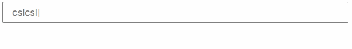

# myplaceholder
placeholder typewriting effect

对输入框的placeholder进行操作.可以设置多个句子, 循环以打字效果显示

## 调用
``` bash
//引入
<script src="myplaceholder.js"></script>
```

``` bash
splaceholder({
  el: inputId,  //input的id
  texts: ["cslcslcslcslcsl", "anni jjjjjxs", "lucysadadqsdf"],
  options: {
    loop: true,
    letterDelay: 100

  }
})
```

